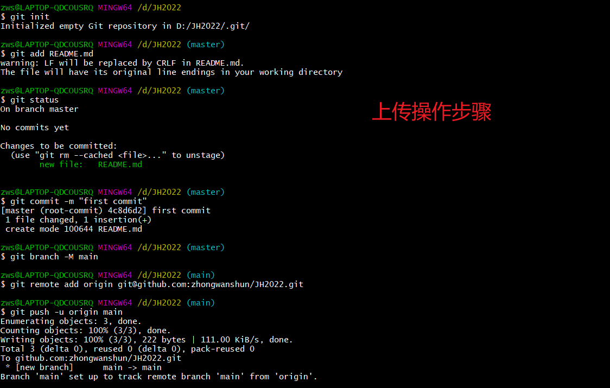

# 																																	                                               JH2022

这是江西软件职业技术大学区块链学院B200602班2022上半年小组合作项目。

### 项目名称:区块链+共享住宅

组名:奋斗小天团

组员：高宇锦肖豪杰，

组长:钟万顺

班级:B200602班

起始时间:2022年2月24日
